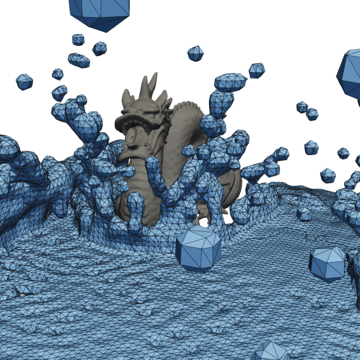
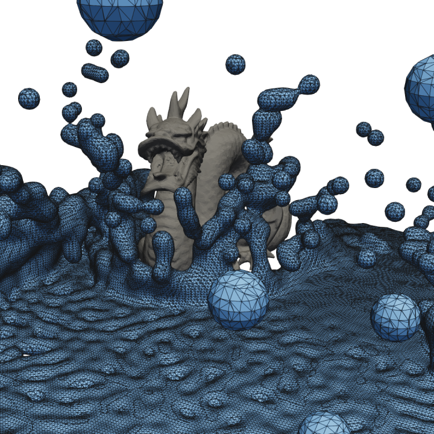

# 
[](https://crates.io/crates/splashsurf)
[](https://docs.rs/splashsurf_lib)
[](https://github.com/InteractiveComputerGraphics/splashsurf)
[](https://github.com/InteractiveComputerGraphics/splashsurf/blob/main/LICENSE)
[](https://deps.rs/repo/github/InteractiveComputerGraphics/splashsurf)
[](https://github.com/InteractiveComputerGraphics/splashsurf/actions/workflows/build.yml)

Surface reconstruction library and CLI for particle data from SPH simulations, written in Rust.

This repository consists of the following crates:
 - `splashsurf`: Binary crate with a CLI (command line interface) to quickly run surface reconstructions of SPH particle data files from the terminal
 - `splashsurf_lib`: Library that implements the reconstruction pipeline used by the CLI. Allows to integrate the reconstruction procedure directly into other Rust applications. Furthermore, it resembles a framework providing access to individual building blocks to create your own surface reconstruction pipeline.

This page provides an overview of the CLI's features and high-level notes on the algorithmic structure and implementation of the reconstruction.

<p align="center">
  
</p>

`splashsurf` is a tool to reconstruct surfaces meshes from SPH particle data.
The first image shows the visualization of a set of particles from an SPH fluid simulation from [SPlisHSPlasH](https://github.com/InteractiveComputerGraphics/SPlisHSPlasH).
The particle radius is `0.025`. As the rendering of a fluid should not look like a ball pit, a surface mesh has to be
reconstructed from this particle data. The next image shows a reconstructed surface mesh of the fluid produced by `splashsurf`
with a "smoothing length" of `2.2` times the particles radius and a cell size of `1.1` times the particle radius. The
third image shows a finer reconstruction with a cell size of `0.45` times the particle radius. These surface meshes can
then be fed into 3D rendering software such as [Blender](https://www.blender.org/) to generate beautiful water animations.
The result might look something like this (please excuse the lack of 3D rendering skills):

<p align="center">

</p>

**Contents**
- [](#)
- [The `splashsurf` CLI](#the-splashsurf-cli)
  - [Introduction](#introduction)
  - [Notes](#notes)
  - [Installation](#installation)
  - [Usage](#usage)
    - [Recommended settings](#recommended-settings)
    - [Benchmark example](#benchmark-example)
    - [Sequences of files](#sequences-of-files)
  - [Input file formats](#input-file-formats)
    - [VTK](#vtk)
    - [VTU](#vtu)
    - [BGEO](#bgeo)
    - [PLY](#ply)
    - [XYZ](#xyz)
    - [JSON](#json)
  - [Output file formats](#output-file-formats)
  - [All command line options](#all-command-line-options)
    - [The `reconstruct` command](#the-reconstruct-command)
    - [The `convert` subcommand](#the-convert-subcommand)
- [License](#license)

# The `splashsurf` CLI

The following sections mainly focus on the CLI of `splashsurf`. For more information on the library, see the [corresponding readme](https://github.com/InteractiveComputerGraphics/splashsurf/blob/main/splashsurf_lib) in the `splashsurf_lib` subfolder or the [`splashsurf_lib` crate](https://crates.io/crates/splashsurf_lib) on crates.io.

## Introduction

This is a basic but high-performance implementation of a marching cubes based surface reconstruction for SPH fluid simulations (e.g performed with [SPlisHSPlasH](https://github.com/InteractiveComputerGraphics/SPlisHSPlasH)).
The output of this tool is the reconstructed triangle surface mesh of the fluid.
At the moment it supports computing normals on the surface using SPH gradients and interpolating scalar and vector particle attributes to the surface.
No additional smoothing or decimation operations are currently implemented.
As input, it supports reading particle positions from `.vtk`, `.bgeo`, `.ply`, `.json` and binary `.xyz` files (i.e. files containing a binary dump of a particle position array).
In addition, required parameters are the kernel radius and particle radius (to compute the volume of particles) used for the original SPH simulation as well as the surface threshold.

By default, a domain decomposition of the particle set is performed using octree-based subdivision.
The implementation first computes the density of each particle using the typical SPH approach with a cubic kernel. 
This density is then evaluated or mapped onto a sparse grid using spatial hashing in the support radius of each particle.
This implies that memory is only allocated in areas where the fluid density is non-zero. This is in contrast to a naive approach where the marching cubes background grid is allocated for the whole domain. 
The marching cubes reconstruction is performed only in the narrowband of grid cells where the density values cross the surface threshold. Cells completely in the interior of the fluid are skipped. For more details, please refer to the [readme of the library]((https://github.com/InteractiveComputerGraphics/splashsurf/blob/main/splashsurf_lib/README.md)).
Finally, all surface patches are stitched together by walking the octree back up, resulting in a closed surface.

## Notes

For small numbers of fluid particles (i.e. in the low thousands or less) the multithreaded implementation may have worse performance due to the task based parallelism and the additional overhead of domain decomposition and stitching.
In this case, you can try to disable the domain decomposition. The reconstruction will then use a global approach that is parallelized using thread-local hashmaps.
For larger quantities of particles the decomposition approach is expected to be always faster.

Due to the use of hash maps and multi-threading (if enabled), the output of this implementation is not deterministic.
In the future, flags may be added to switch the internal data structures to use binary trees for debugging purposes.

As shown below, the tool can handle the output of large simulations.
However, it was not tested with a wide range of parameters and may not be totally robust against corner-cases or extreme parameters.
If you experience problems, please report them together with your input data.

## Installation

The command-line tool can be built from this repository but is also available on crates.io.
If you have a [Rust toolchain installed](https://www.rust-lang.org/tools/install) you can install `splashsurf` with the command
```
cargo install splashsurf
```

## Usage

### Recommended settings
Good settings for the surface reconstruction depend on the original simulation and can be influenced by different conventions of different simulators. The following settings appear to work well with [SPlisHSPlasH](https://github.com/InteractiveComputerGraphics/SPlisHSPlasH):
 - `particle-radius`: should be a bit larger than the particle radius used for the actual simulation. A radius around 1.4 to 1.6 times larger than the original SPH particle radius seems to be appropriate.
 - `smoothing-length`: should be set around `1.2`. Larger values smooth out the iso-surface more but also artificially increase the fluid volume.
 - `surface-threshold`: a good value depends on the selected `particle-radius` and `smoothing-length` and can be used to counteract a fluid volume increase e.g. due to a larger particle radius. In combination with the other recommended values a threshold of `0.6` seemed to work well.
 - `cube-size` usually should not be chosen larger than `1.0` to avoid artifacts (e.g. single particles decaying into rhomboids), start with a value in the range of `0.75` to `0.5` and decrease/increase it if the result is too coarse or the reconstruction takes too long.

### Benchmark example
For example:
```
splashsurf reconstruct canyon_13353401_particles.xyz -r=0.011 -c=1.5 -l=2.0 -t=0.6 --subdomain-grid=on
```
With these parameters, a scene with 13353401 particles is reconstructed in less than 3 seconds on a Ryzen 9 5950X. The output is a mesh with 6069576 triangles.
```
[23:44:58.432][INFO] splashsurf v0.10.0 (splashsurf)
[23:44:58.432][INFO] Called with command line: splashsurf reconstruct canyon_13353401_particles.xyz -r=0.011 -c=1.5 -l=2.0 -t=0.6 --subdomain-grid=on
[23:44:58.432][INFO] Using single precision (f32) for surface reconstruction.
[23:44:58.432][INFO] Reading particle dataset from "canyon_13353401_particles.xyz"...
[23:44:58.515][INFO] Successfully read dataset with 13353401 particle positions.
[23:44:58.520][INFO] Minimal enclosing bounding box of particles was computed as: AxisAlignedBoundingBox { min: [-25.0060978, -5.0146289, -40.0634613], max: [24.4994926, 18.3062096, 39.7757950] }
[23:44:58.520][INFO] The ghost margin volume is 42.38% of the subdomain volume
[23:44:58.520][INFO] The ghost margin is 3.03 MC cells or 0.05 subdomains thick
[23:44:58.520][INFO] Number of subdomains: 82156 (47x23x76)
[23:44:58.520][INFO] Number of MC cells per subdomain: 262144 (64x64x64)
[23:44:58.520][INFO] Number of MC cells globally: 21536702464 (3008x1472x4864)
[23:44:58.520][INFO] Starting classification of particles into subdomains.
[23:44:58.601][INFO] Starting computation of global density vector.
[23:44:59.548][INFO] Largest subdomain has 167861 particles.
[23:44:59.548][INFO] Subdomains with 3358 or less particles will be considered sparse.
[23:44:59.548][INFO] Starting reconstruction (level-set evaluation and local triangulation).
[23:45:00.876][INFO] Starting stitching of subdomains to global mesh.
[23:45:00.946][INFO] Global mesh has 3038116 vertices and 6069576 triangles.
[23:45:00.996][INFO] Writing surface mesh to "canyon_surface.vtk"...
[23:45:00.996][INFO] Writing mesh with 3038116 vertices and 6069576 cells to "canyon_surface.vtk"...
[23:45:01.175][INFO] Successfully wrote mesh to file.
[23:45:01.175][INFO] Done.
[23:45:01.188][INFO] Successfully finished processing all inputs.
[23:45:01.188][INFO] Timings:
[23:45:01.188][INFO] reconstruct subcommand: 100.00%, 2756.58ms avg, 1 call (total: 2.757s)
[23:45:01.188][INFO]   surface reconstruction: 100.00%, 2756.54ms avg, 1 call (total: 2.757s)
[23:45:01.188][INFO]     loading particle positions: 3.00%, 82.68ms avg, 1 call (total: 0.083s)
[23:45:01.188][INFO]     compute minimum enclosing aabb: 0.21%, 5.91ms avg, 1 call (total: 0.006s)
[23:45:01.188][INFO]     surface reconstruction subdomain-grid: 88.17%, 2430.35ms avg, 1 call (total: 2.430s)
[23:45:01.188][INFO]       decomposition: 3.29%, 80.06ms avg, 1 call (total: 0.080s)
[23:45:01.188][INFO]         classifying particles: 21.22%, 16.99ms avg, 1 call (total: 0.017s)
[23:45:01.188][INFO]         merging TL per cell particle counters: 0.18%, 0.14ms avg, 1 call (total: 0.000s)
[23:45:01.188][INFO]         initializing flat subdomain data and index mapping: 0.08%, 0.06ms avg, 1 call (total: 0.000s)
[23:45:01.188][INFO]         copying particles to subdomains: 64.65%, 51.76ms avg, 1 call (total: 0.052s)
[23:45:01.188][INFO]         sort subdomain particles: 13.74%, 11.00ms avg, 1 call (total: 0.011s)
[23:45:01.188][INFO]       compute_global_density_vector: 39.00%, 947.82ms avg, 1 call (total: 0.948s)
[23:45:01.188][INFO]         subdomain density computation: ≈100.00%, 20.58ms avg, 1275 calls (total: 26.235s)
[23:45:01.188][INFO]           collect subdomain data: 0.67%, 0.14ms avg, 1275 calls (total: 0.175s)
[23:45:01.188][INFO]           initialize particle filter: 0.27%, 0.06ms avg, 1275 calls (total: 0.072s)
[23:45:01.188][INFO]           neighborhood_search_spatial_hashing_flat_filtered: 88.48%, 18.21ms avg, 1275 calls (total: 23.214s)
[23:45:01.188][INFO]             sequential_generate_cell_to_particle_map: 4.07%, 0.74ms avg, 1275 calls (total: 0.946s)
[23:45:01.188][INFO]             write particle neighbors: 95.09%, 17.31ms avg, 1275 calls (total: 22.074s)
[23:45:01.188][INFO]           sequential_compute_particle_densities_filtered: 10.30%, 2.12ms avg, 1275 calls (total: 2.702s)
[23:45:01.188][INFO]           update global density values: 0.26%, 0.05ms avg, 1275 calls (total: 0.068s)
[23:45:01.188][INFO]       reconstruction: 54.63%, 1327.61ms avg, 1 call (total: 1.328s)
[23:45:01.188][INFO]         subdomain reconstruction (sparse): ≈1.95%, 0.85ms avg, 899 calls (total: 0.768s)
[23:45:01.188][INFO]           density grid loop: 65.87%, 0.56ms avg, 899 calls (total: 0.506s)
[23:45:01.188][INFO]           mc triangulation loop: 25.02%, 0.21ms avg, 899 calls (total: 0.192s)
[23:45:01.188][INFO]         subdomain reconstruction (dense): ≈98.05%, 102.70ms avg, 376 calls (total: 38.617s)
[23:45:01.188][INFO]           density grid loop: 94.47%, 97.03ms avg, 376 calls (total: 36.482s)
[23:45:01.188][INFO]           mc triangulation loop: 5.19%, 5.33ms avg, 376 calls (total: 2.005s)
[23:45:01.188][INFO]       stitching: 2.84%, 69.04ms avg, 1 call (total: 0.069s)
[23:45:01.188][INFO]         surface patch offset scan: 0.01%, 0.01ms avg, 1 call (total: 0.000s)
[23:45:01.188][INFO]         copy interior verts/tris and deduplicate exterior verts: 83.51%, 57.65ms avg, 1 call (total: 0.058s)
[23:45:01.188][INFO]     write surface mesh to file: 6.50%, 179.17ms avg, 1 call (total: 0.179s)
[23:45:01.188][INFO]       writing mesh: 99.98%, 179.14ms avg, 1 call (total: 0.179s)
```

### Sequences of files

You can either process a single file or let the tool automatically process a sequence of files.
A sequence of files is indicated by specifying a filename with a `{}` placeholder pattern in the name.
The tool will treat the placeholder as a `(\d+)` regex, i.e. a group matching to at least one digit.
This allows for any zero padding as well as non-zero padded incrementing indices.
All files in the input path matching this pattern will then be processed in natural sort order (i.e. silently skipping missing files in the sequence).
Note that the tool collects all existing filenames as soon as the command is invoked and does not update the list while running.
The first and last file of a sequences that should be processed can be specified with the `-s`/`--start-index` and/or `-e`/`--end-index` arguments.

By specifying the flag `--mt-files=on`, several files can be processed in parallel.
If this is enabled, you should ideally also set `--mt-particles=off` as enabling both will probably degrade performance.
The combination of `--mt-files=on` and `--mt-particles=off` can be faster if many files with only few particles have to be processed.

## Input file formats

### VTK

Legacy VTK files with the "`.vtk`" extension are loaded using [`vtkio`](https://crates.io/crates/vtkio). 
The VTK file is loaded as a big endian binary file and has to contain an "Unstructured Grid" with either `f32` or `f64` vertex coordinates. 
Any other data or attributes are ignored except for those attributes that were specified with the ` --interpolate-attributes` command line argument. 
Currently supported attribute data types are scalar integers, floats and three-component float vectors.
Only the first "Unstructured Grid" is loaded, other entities are ignored.

Not that currently only the "pure" v4.2 legacy format is supported as documented on [here](https://kitware.github.io/vtk-examples/site/VTKFileFormats/#simple-legacy-formats).
This corresponds to the `--output-format vtk42` flag of the [`meshio convert`](https://github.com/nschloe/meshio) tool.

### VTU

VTK XML files with the "`.vtu`" extension are loaded using [`vtkio`](https://crates.io/crates/vtkio).
Currently only VTU files using ASCII or encoded binary are supported.
Files using "raw" binary sections (i.e. a `<AppendedData encoding="raw">...</AppendedData>` block) are not supported by `vtkio` at the moment.

### BGEO

Files with the "`.bgeo`" extension are loaded using a custom parser. 
Note, that only the "old" `BGEOV` format is supported (which is the format supported by "Partio"). 
Both uncompressed and (gzip) compressed files are supported. 
Only points and their implicit position vector attributes are loaded from the file. 
All other entities (e.g. vertices) and other attributes are ignored/discarded. 
Notably, the parser supports BGEO files written by [SPlisHSPlasH](https://github.com/InteractiveComputerGraphics/SPlisHSPlasH) ("Partio export"). 

### PLY

Files with the "`.ply`" extension are loaded using [`ply-rs`](https://crates.io/crates/ply-rs). 
The PLY file has to contain an element called "`vertex`" with the properties `x`, `y` and `z` of type `f32`/["`Property::Float`"](https://docs.rs/ply-rs/0.1.3/ply_rs/ply/enum.Property.html#variant.Float). 
Any other properties or elements are ignored.

### XYZ

Files with the "`.xyz`" extension are interpreted as raw bytes of `f32` values in native endianness of the system. 
Three consecutive `f32`s represent a (x,y,z) coordinate triplet of a fluid particle.

### JSON

Files with the "`.json`" extension are interpreted as serializations of a `Vec<[f32; 3]>` where each three component array represents a particle position. 
This corresponds to a JSON file with a structure like this for example:
```json
[
    [1.0, 2.0, 3.0],
    [1.0, 2.0, 3.0],
]
```

## Output file formats

Currently, only VTK and OBJ formats are supported to store the reconstructed surface meshes. 
Both formats support output of normals but only VTK supports additional fields such as interpolated scalar or vector fields. 
The file format is inferred from the extension of output filename.

## All command line options

### The `reconstruct` command
```
splashsurf-reconstruct (v0.9.3) - Reconstruct a surface from particle data

Usage: splashsurf reconstruct [OPTIONS] --particle-radius <PARTICLE_RADIUS> --smoothing-length <SMOOTHING_LENGTH> --cube-size <CUBE_SIZE> <INPUT_FILE_OR_SEQUENCE>

Options:
  -h, --help     Print help
  -V, --version  Print version

Input/output:
  -o, --output-file <OUTPUT_FILE>  Filename for writing the reconstructed surface to disk (default: "{original_filename}_surface.vtk")
      --output-dir <OUTPUT_DIR>    Optional base directory for all output files (default: current working directory)
  -s, --start-index <START_INDEX>  Index of the first input file to process when processing a sequence of files (default: lowest index of the sequence)
  -e, --end-index <END_INDEX>      Index of the last input file to process when processing a sequence of files (default: highest index of the sequence)
  <INPUT_FILE_OR_SEQUENCE>     Path to the input file where the particle positions are stored (supported formats: VTK 4.2, VTU, binary f32 XYZ, PLY, BGEO), use "{}" in the filename to indicate a placeholder for a sequence

Numerical reconstruction parameters:
  -r, --particle-radius <PARTICLE_RADIUS>
          The particle radius of the input data
      --rest-density <REST_DENSITY>
          The rest density of the fluid [default: 1000.0]
  -l, --smoothing-length <SMOOTHING_LENGTH>
          The smoothing length radius used for the SPH kernel, the kernel compact support radius will be twice the smoothing length (in multiplies of the particle radius)
  -c, --cube-size <CUBE_SIZE>
          The cube edge length used for marching cubes in multiplies of the particle radius, corresponds to the cell size of the implicit background grid
  -t, --surface-threshold <SURFACE_THRESHOLD>
          The iso-surface threshold for the density, i.e. the normalized value of the reconstructed density level that indicates the fluid surface (in multiplies of the rest density) [default: 0.6]
      --domain-min <X_MIN> <Y_MIN> <Z_MIN>
          Lower corner of the domain where surface reconstruction should be performed (requires domain-max to be specified)
      --domain-max <X_MIN> <Y_MIN> <Z_MIN>
          Upper corner of the domain where surface reconstruction should be performed (requires domain-min to be specified)

Advanced parameters:
  -d, --double-precision=<off|on>  Whether to enable the use of double precision for all computations [default: off] [possible values: off, on]
      --mt-files=<off|on>          Flag to enable multi-threading to process multiple input files in parallel [default: off] [possible values: off, on]
      --mt-particles=<off|on>      Flag to enable multi-threading for a single input file by processing chunks of particles in parallel [default: on] [possible values: off, on]
  -n, --num-threads <NUM_THREADS>  Set the number of threads for the worker thread pool

Octree (domain decomposition) parameters:
      --octree-decomposition=<off|on>
          Whether to enable spatial decomposition using an octree (faster) instead of a global approach [default: on] [possible values: off, on]
      --octree-stitch-subdomains=<off|on>
          Whether to enable stitching of the disconnected local meshes resulting from the reconstruction when spatial decomposition is enabled (slower, but without stitching meshes will not be closed) [default: on] [possible values: off, on]
      --octree-max-particles <OCTREE_MAX_PARTICLES>
          The maximum number of particles for leaf nodes of the octree, default is to compute it based on the number of threads and particles
      --octree-ghost-margin-factor <OCTREE_GHOST_MARGIN_FACTOR>
          Safety factor applied to the kernel compact support radius when it's used as a margin to collect ghost particles in the leaf nodes when performing the spatial decomposition
      --octree-global-density=<off|on>
          Whether to compute particle densities in a global step before domain decomposition (slower) [default: off] [possible values: off, on]
      --octree-sync-local-density=<off|on>
          Whether to compute particle densities per subdomain but synchronize densities for ghost-particles (faster, recommended). Note: if both this and global particle density computation is disabled the ghost particle margin has to be increased to at least 2.0 to compute correct density values for ghost particles [default: on] [possible values: off, on]

Interpolation:
      --normals=<off|on>
          Whether to compute surface normals at the mesh vertices and write them to the output file [default: off] [possible values: off, on]
      --sph-normals=<off|on>
          Whether to compute the normals using SPH interpolation (smoother and more true to actual fluid surface, but slower) instead of just using area weighted triangle normals [default: on] [possible values: off, on]
      --interpolate-attributes <INTERPOLATE_ATTRIBUTES>
          List of point attribute field names from the input file that should be interpolated to the reconstructed surface. Currently this is only supported for VTK and VTU input files

Debug options:
      --output-dm-points <OUTPUT_DM_POINTS>
          Optional filename for writing the point cloud representation of the intermediate density map to disk
      --output-dm-grid <OUTPUT_DM_GRID>
          Optional filename for writing the grid representation of the intermediate density map to disk
      --output-octree <OUTPUT_OCTREE>
          Optional filename for writing the octree used to partition the particles to disk
      --check-mesh=<off|on>
          Whether to check the final mesh for topological problems such as holes (note that when stitching is disabled this will lead to a lot of reported problems) [default: off] [possible values: off, on]
```

### The `convert` subcommand

Allows conversion between particle file formats and between mesh file formats. For particles `VTK, BGEO, PLY, XYZ, JSON -> VTK` 
is supported. For meshes only `VTK, PLY -> VTK, OBJ` is supported.

```
splashsurf-convert (v0.9.0) - Convert particle or mesh files between different file formats

Usage: splashsurf.exe convert [OPTIONS] -o <OUTPUT_FILE>

Options:
      --particles <INPUT_PARTICLES>
          Path to the input file with particles to read (supported formats: .vtk, .vtu, .bgeo, .ply, .xyz, .json)
      --mesh <INPUT_MESH>
          Path to the input file with a surface to read (supported formats: .vtk, .ply)
  -o <OUTPUT_FILE>
          Path to the output file (supported formats for particles: .vtk, .bgeo, .json, for meshes: .obj, .vtk)
      --overwrite
          Whether to overwrite existing files without asking
      --domain-min <X_MIN> <Y_MIN> <Z_MIN>
          Lower corner of the domain of particles to keep (requires domain-max to be specified)
      --domain-max <X_MIN> <Y_MIN> <Z_MIN>
          Lower corner of the domain of particles to keep (requires domain-min to be specified)
  -h, --help
          Print help
  -V, --version
          Print version
```

# License

For license information of this project, see the LICENSE file.
The splashsurf logo is based on two graphics ([1](https://www.svgrepo.com/svg/295647/wave), [2](https://www.svgrepo.com/svg/295652/surfboard-surfboard)) published on SVG Repo under a CC0 ("No Rights Reserved") license. 
The dragon model shown in the images on this page are part of the ["Stanford 3D Scanning Repository"](https://graphics.stanford.edu/data/3Dscanrep/).
