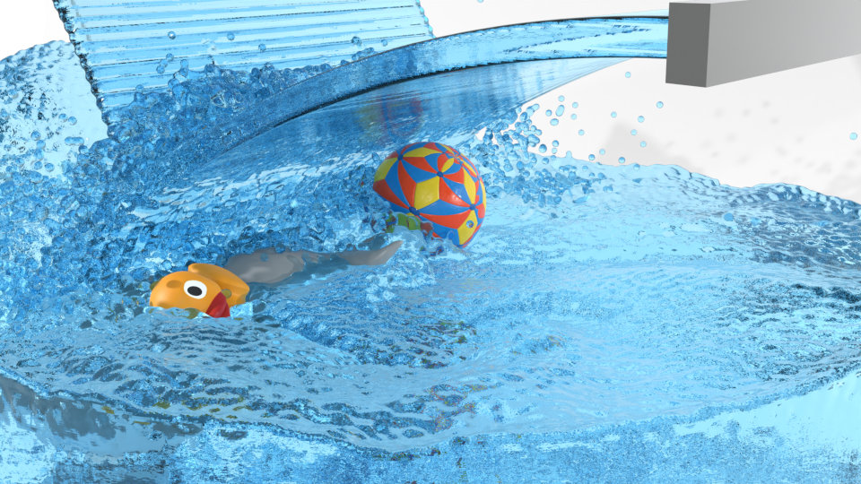
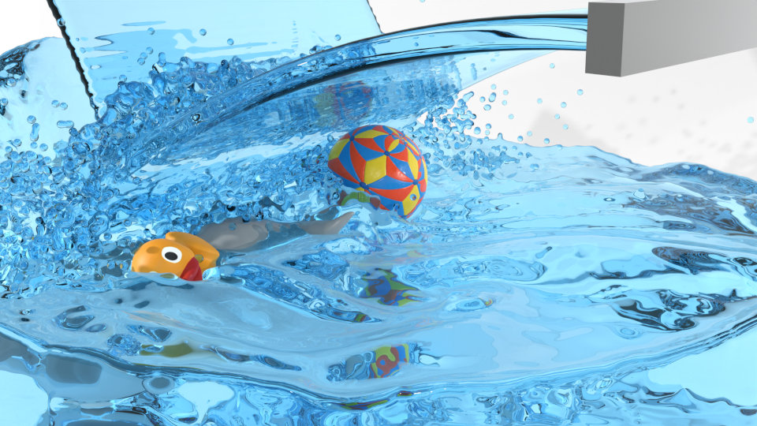

---
**NEW**: The project now implements the paper ["Weighted Laplacian Smoothing for Surface Reconstruction of Particle-based Fluids" (Löschner, Böttcher, Jeske, Bender; 2023)](https://animation.rwth-aachen.de/publication/0583/). 
It proposes a fast smoothing approach to avoid the typical bumpiness of the surfaces reconstructed from SPH simulations while preventing loss of volume for splashes and droplets that occurs with simple, non-speaclized smoothing methods.
The images below show a rendering of a typical surface reconstruction (on the right) with visible bumps due to the SPH particles compared to the same surface reconstruction with weighted smoothing applied (on the left):

 

You can see this rendering in motion in [this video](https://youtu.be/2bYvaUXlBQs). For more details see the [paper](https://animation.rwth-aachen.de/publication/0583/) and the [readme](https://github.com/InteractiveComputerGraphics/splashsurf) in the repository.

---

This project consists of the following crates:
 - `splashsurf`: Binary crate with a CLI (command line interface) to quickly run surface reconstructions of SPH particle data files from the terminal
 - `splashsurf_lib`: Library that implements the reconstruction pipeline used by the CLI. Allows to integrate the reconstruction procedure directly into other Rust applications. Furthermore, it resembles a framework providing access to individual building blocks to create your own surface reconstruction pipeline.

  

`splashsurf` is a tool to reconstruct surfaces meshes from SPH particle data.
The first image shows the visualization of a set of particles from an SPH fluid simulation from [SPlisHSPlasH](https://github.com/InteractiveComputerGraphics/SPlisHSPlasH).
The particle radius is `0.025`. As the rendering of a fluid should not look like a ball pit, a surface mesh has to be
reconstructed from this particle data. The next image shows a reconstructed surface mesh of the fluid produced by `splashsurf`
with a "smoothing length" of `2.2` times the particles radius and a cell size of `1.1` times the particle radius. The
third image shows a finer reconstruction with a cell size of `0.45` times the particle radius. These surface meshes can
then be fed into 3D rendering software such as [Blender](https://www.blender.org/) to generate beautiful water animations.
The result might look something like this:

