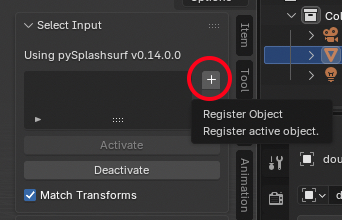
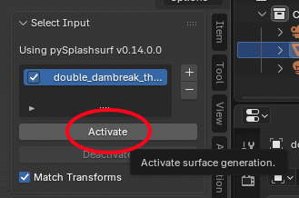
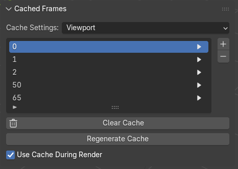
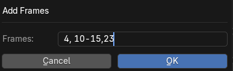
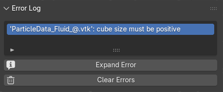

# Splashsurf Studio
Splashsurf Studio is a Blender add-on for on-the-fly surface reconstruction of fluid simulation data. It leverages the `pySplashsurf` Python library, which is based on the [`splashsurf`](https://splashsurf.physics-simulation.org/) tool and library.

The add-on interface can be found in the 3D Viewport toolbar (accessible via the `N` key) while in Object Mode.

Splashsurf Studio interprets the vertex positions of any Blender object as particle coordinates to perform surface reconstruction using `pySplashsurf`.
A common workflow involves loading particle data from SPH (Smoothed Particle Hydrodynamics) simulations using the [Sequence Loader add-on](https://extensions.blender.org/add-ons/sequence-loader/).
As the Sequence Loader updates the input file on each frame change, Splashsurf Studio automatically refreshes the surface reconstruction to reflect the new data.

### Note on Geometry Nodes

Currently, the add-on cannot use geometry generated by Geometry Nodes as input for surface reconstruction due to Blender's execution order.
Only base geometry or geometry loaded via tools like the Sequence Loader add-on is supported.
However, the reconstructed surface itself can be used as an input for Geometry Nodes.
If you are interested in contributing to improve the flexibility of the add-on, please contact us via our [GitHub repository](https://github.com/InteractiveComputerGraphics/splashsurf).

If you want to use both, Geometry Nodes *and* Splashsurf, on the same input geometry (e.g. to render particles and surfaces in the same scene) it is recommended to create a separate object with a placeholder mesh (e.g. a cube) for Geometry Nodes.
Inside the Geometry Nodes of this new object you can refer to the common input geometry object and ignore the placeholder geometry.

## Basic Workflow
Assuming you have already imported your particle data (e.g., using the [Sequence Loader add-on](https://extensions.blender.org/add-ons/sequence-loader/)), you can set up the surface reconstruction as follows:

1. Select your particle data in the Outliner.  
   
1. Click the "+" button in the "Select Input" panel to use the currently selected object's vertices for reconstruction.  
   
2. Edit the reconstruction parameters in the "Viewport Settings" and "Render Settings" panels. 
   Viewport settings are used when reconstructions are updated in the 3D Viewport, while render settings are applied to update reconstructions during rendering.
   Typically, you would use a low-resolution reconstruction in the viewport for better performance and high-resolution settings for renders.
1. Activate automatic reconstruction in the 'Select Input' panel to start the process.  
   

The add-on will now reconstruct a surface from the input vertices and automatically update it on frame changes (e.g., when the input data changes via the [Sequence Loader add-on](https://extensions.blender.org/add-ons/sequence-loader/)).

## Caching
You can cache reconstructions for specific frames using the 'Cached Frames' panel.
For frames added to the cache list, the surface reconstruction is performed once and then loaded from the cache when you switch to that frame.
This allows you to quickly switch between specific frames to check camera and light settings, for example, without waiting for a new reconstruction.
Changing reconstruction settings does not affect cached frames unless you manually regenerate them.



The "Cache Settings" property determines whether the viewport or render settings are used for the cache.

Add frames to the cache by clicking the "+" button.
This opens a window where you can input a string of frames to be cached: 



This string adds frames 4, 10, 11, 12, 13, 14, 15, and 23 to the cache list.
To remove frames, select them and click the "-" button, or use the "Clear Cache" operator to remove all frames.

Reconstructions for newly added frames are generated the next time the frame is changed.
All cached reconstructions can be updated manually using the "Regenerate Cache" button.

## Other Operators
- **Parse CLI String**: Extracts parameters from a `splashsurf` CLI command (e.g., `splashsurf reconstruct input_{}.vtk -r=0.025 ...`).
- **Get CLI String**: Performs the reverse operation, creating a CLI option string from the selected parameters and printing it to the Blender console.
- **Test Render Params**: Runs the surface reconstruction using the render settings without modifying the mesh. It outputs the reconstruction time, vertex and triangle counts, and approximate memory usage.

## Notes
 - When using the [Sequence Loader add-on](https://extensions.blender.org/add-ons/sequence-loader/), Splashsurf Studio requires the particle data object's global visibility to be enabled. However, it can be hidden in the viewport (by clicking the eye icon in the Outliner) without issues.
 - By default, a `COPY_TRANSFORMS` constraint is added to the surface reconstruction, matching its transform to the particle data. This prevents the surface from being moved independently. If this is not desired, simply remove the constraint.
 - If an error occurs during surface reconstruction, it will be displayed in a dedicated error panel:  
    
 - The add-on automatically enables `Render > Lock Interface` to prevent crashes during rendering.

## Version History

 - **Version 1.0.1**: Split extension into packages per platform, remove image files from package
 - **Version 1.0.0**: Initial submission, based on `pySplashsurf 0.14.0.0`

## Preparing extension release
To package the extension for the Blender extension repository use the `blender --command extension build` command.
Use the `--split-platforms` flag to reduce size for individual platforms.
On MacOS the full command to run in this folder is:
```
/Applications/Blender.app/Contents/MacOS/Blender --command extension build --source-dir src --split-platforms
```
Remember to update the packaged wheels and to update version numbers in the add-on.

## Acknowledgements

This add-on contains notable contributions from the following people:
 - [Felix Kern](https://github.com/Fek04) ([@Fek04](https://github.com/Fek04)) contributed the initial implementation of the Blender add-on and the `pySplashsurf` bindings
 - [Fabian Löschner](https://www.floeschner.de/) ([@w1th0utnam3](https://github.com/w1th0utnam3)) is the main author of `splashsurf` itself and current maintainer of the extension and Python bindings

